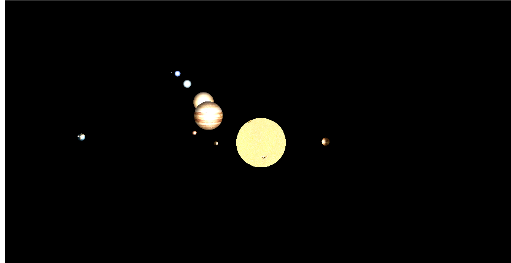

## Лабораторна робота № 4

#### Тема: «Побудова найпростіших тривимірних об'єктів за допомогою бібліотеки Java3D та їх анімація»

##### Завдання:

За допомогою засобів, що надає бібліотека Java3D, побудувати тривимірний об’єкт. Для цього скористатися основними примітивами, що буде доцільно використовувати згідно варіанту: сфера, конус, паралелепіпед, циліндр. Об'єкт має складатися з 5-15 примітивів. Задати матеріал кожного примітиву, в разі необхідності накласти текстуру. В сцені має бути мінімум одне джерело освітлення.

Виконати анімацію сцени таким чином, щоб можна було розглянути об'єкт з усіх сторін. За бажанням можна виконати інтерактивні взаємодію з об'єктом за допомогою миші та клавіатури.
##### Варіант № 6: Сонячна система
